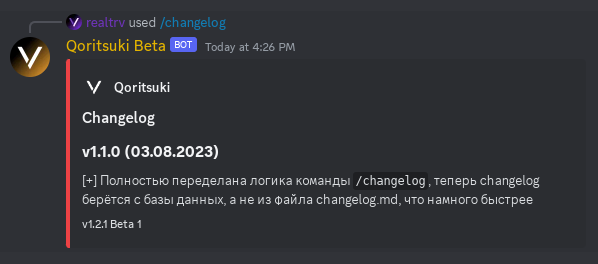

# /changelog (Changelog)

### Аргументы:

#### version

Здесь можно выбрать changelog конкретной версии. Без этого аргумента выводится changelog для последней версии.

**latest**

Выводит changelog для последней версии

### Пример использования:

`/changelog version: 1.1.0`

<figure><figcaption>
/changelog version: 1.1.0
</figcaption></figure>

`/changelog version: latest`

<figure><figcaption>
/changelog version: latest
</figcaption></figure>

`/changelog`

<figure><figcaption>
/changelog
</figcaption></figure>

