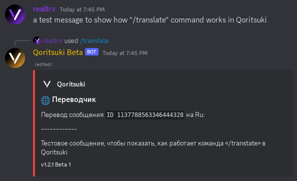

# /translate (Переводчик)

### Аргументы:

`query` - фраза для перевода. Необязательный аргумент.

`message_id` - ID сообщения (если нужно перевести чьё-нибудь сообщение). Необязательный аргумент.

`lang` - язык, на который нужно перевести фразу/сообщение. Необязательный аргумент.

### Пример использования:

`/translate lang: ru message_id: 1137788563346444328`

<figure><figcaption>
<code>/translate</code>
</figcaption></figure>

