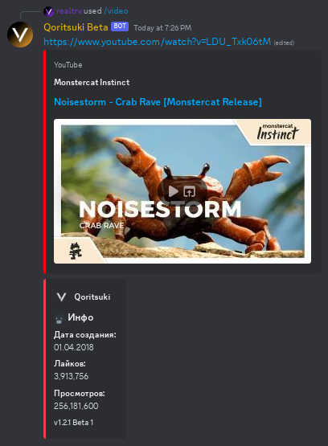

# /video (Видео)

### Аргументы:

`query` - фраза, по которой бот будет искать видео. Обязательный аргумент.

### Пример использования:

`/video query: Monstercat Instinct Noisestorm - "Crab Rave"`

<figure><figcaption></figcaption></figure>

