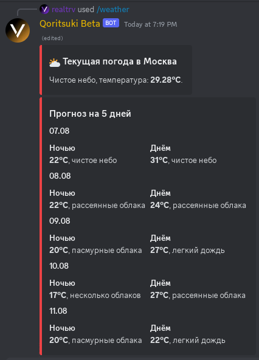

# /weather (Погода)

### Аргументы:

`city` - ввод города, в котором нужно узнать погоду. Обязательный аргумент.

### Пример использования:

`/weather city: Moscow`

<figure><figcaption>
/weather city: Moscow
</figcaption></figure>

